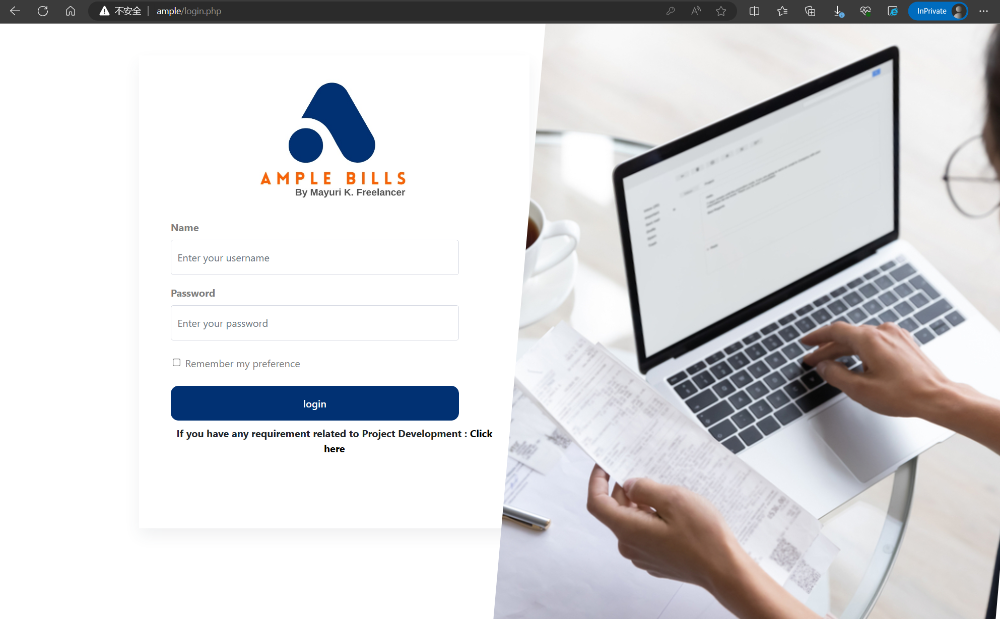
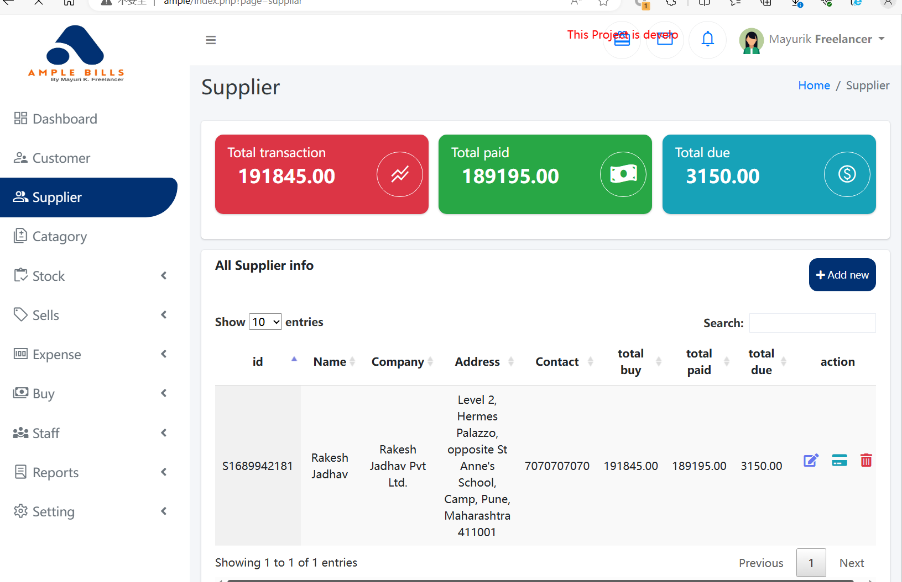
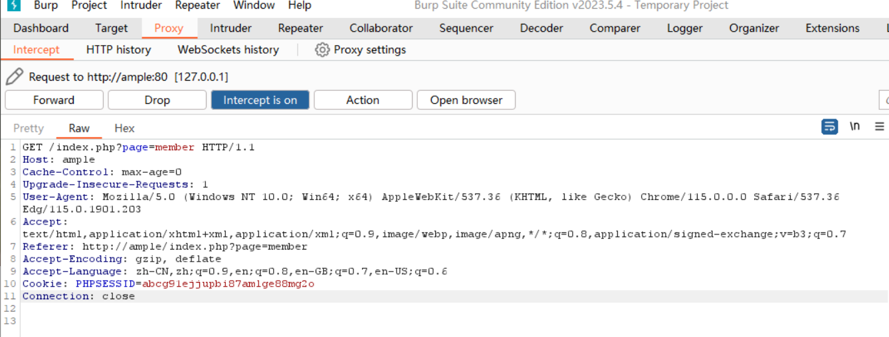
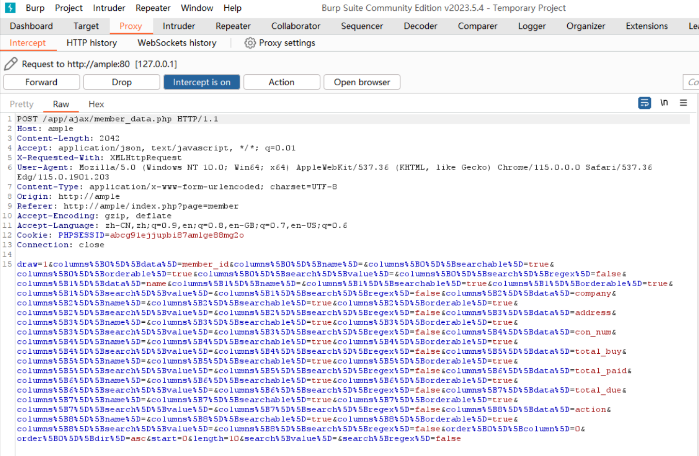
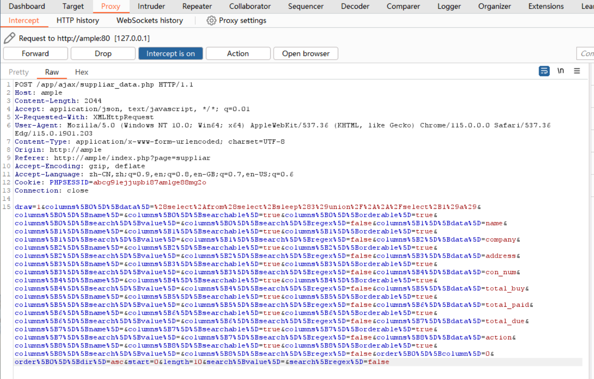
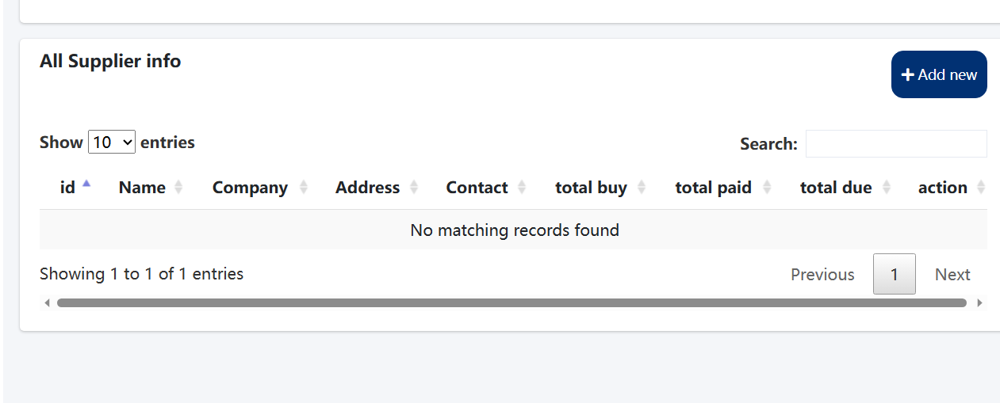
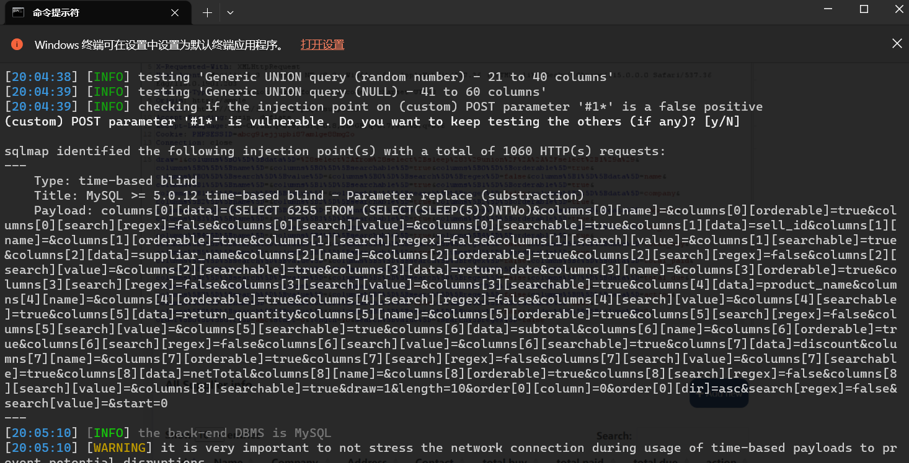
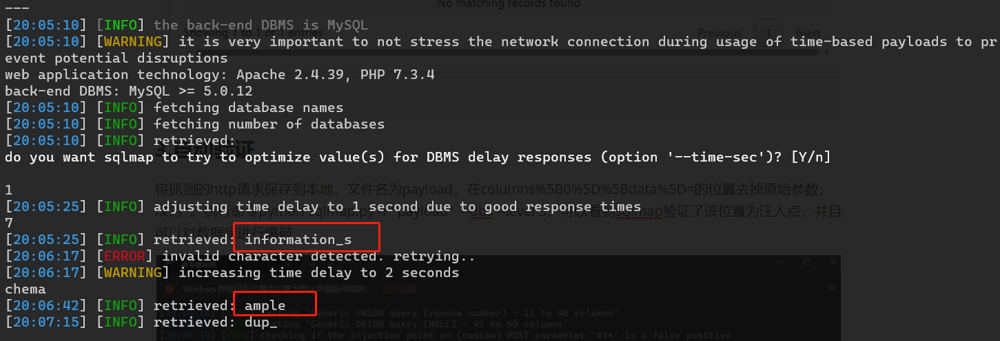

The CMS in use is the "Free and Open Source Inventory Management System." The website link is Free and Open Source Inventory Management System PHP Source Code | SourceCodester. The discovered vulnerability is a blind SQL injection. The first step is to set up the environment. Then, a manual test will be conducted to verify the vulnerability. Finally, sqlmap will be used to confirm its existence.

### 1. Setting up the environment

After downloading the CMS zip file, extract the PHP source code and place it in the web directory. Follow the setup instructions to create a MySQL database named "ample." Next, import the file ample/database/ample.sql to set up the necessary tables. Modify the configuration file at ample\app\config\config.php and set the database name, username, and password. Once done, navigate to the website. If the following page appears without any database error, it indicates successful environment setup. (From the database, the default username can be observed as mayuri.infospace@gmail.com, and the password is 'admin'. The database stores the hash value of the password.)

### 2. Manual Verification

After navigating to the http://ample/index.php?page=member page, one can observe that this page displays customer information.

Activate the proxy and use burpsuite for packet capture. Upon refreshing the page, the following request appears in burpsuite:

After letting the request through, burpsuite intercepts another request:

Upon allowing the second request to pass, the customer information is displayed as usual. If one replaces the content of the parameter in the second request, a time-based blind injection can be identified. The payload is (select*from(select+sleep(3)union/**/select+1)a). The URL encoding of the payload is %28select%2Afrom%28select%2Bsleep%283%29union%2F%2A%2A%2Fselect%2B1%29a%29. After refreshing the page and replacing the member_id in the second request, the page return is delayed by 3 seconds, and the customer information displays "No matching records found."

### 3. Automatic Verification

Save the captured HTTP request locally with the filename "payload". Remove the original parameter from the location of columns%5B0%5D%5Bdata%5D= and replace it with '*'. Run the command python sqlmap.py -r "payload" --dbs --level 3, and one can see that sqlmap verified the location as an injection point and is capable of brute-forcing the database.

Information about two database names, information_schema and ample, has been obtained.

