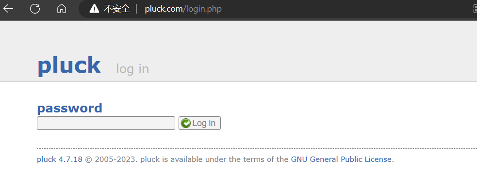
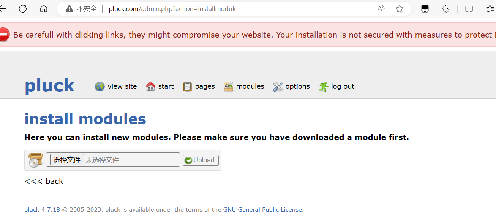
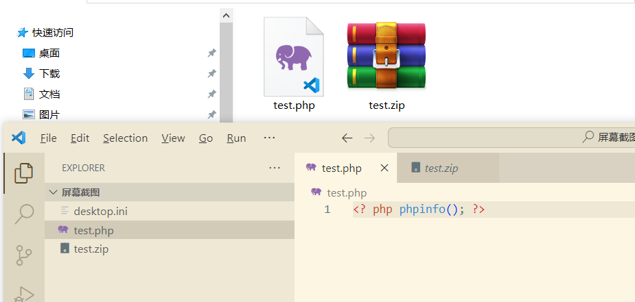
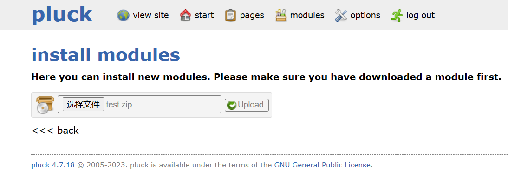
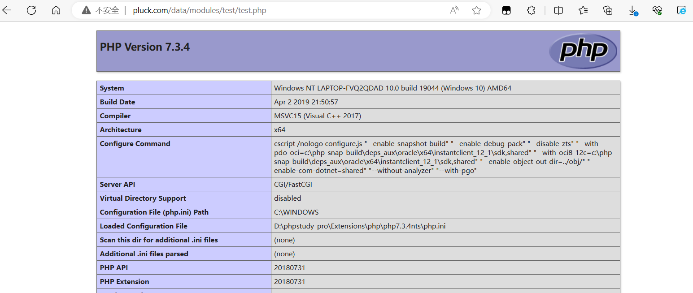

The environment can be downloaded at https://github.com/pluck-cms/pluck

Set up the login address as follows
http://pluck.com/login.php

Login to proceed and enter the specified page below
http://pluck.com/admin.php?action=installmodule

To upload a file in install modules, prepare a test.php file with <? php phpinfo(); ?>. Compress it into a zip file for uploading. 

The file can be accessed with the following url:
http://pluck.com/data/modules/test/test.php

The uploaded file is stored in the following location:
In /data/modules/filename/filename.php
