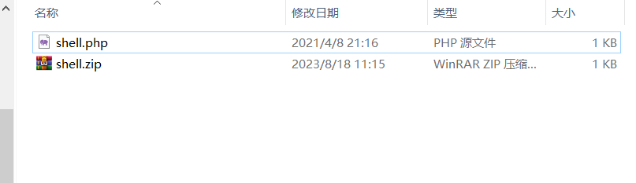
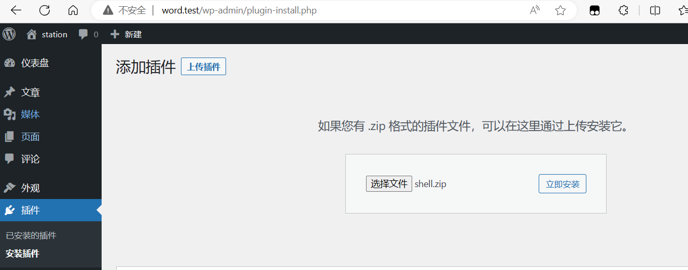
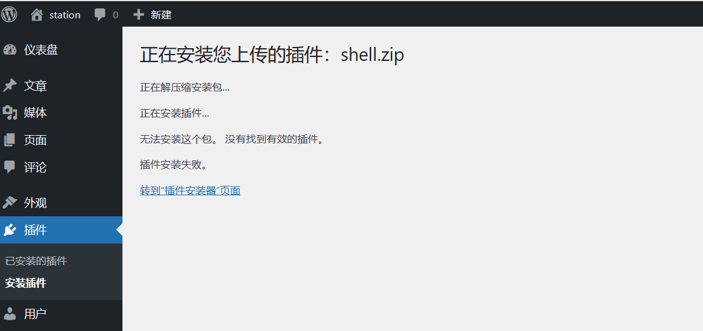
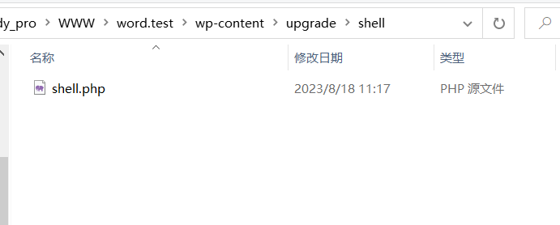
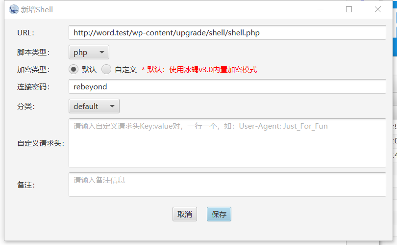
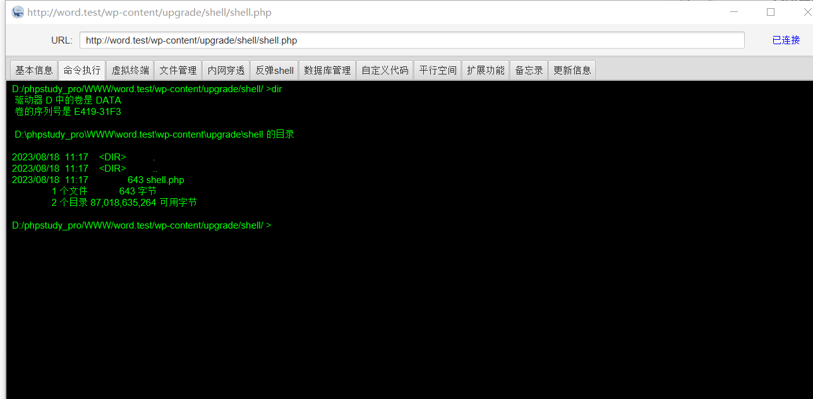

"Behinder is a webshell management tool, consisting of shell code and a client. After uploading the client to a website, you can connect through it to obtain webshell access. For demonstration purposes, we are using it here. The download link for Behinder is https://github.com/rebeyond/Behinder/releases (other webshells operate similarly).

## 1 First, compress the shell into a zip file.

## 2 Upload the zip file through the plugin upload feature.

## 3 WordPress indicates a plugin installation failure.

## 4 However, the shell is not deleted and the shell is stored in the website directory at /wp-content/upgrade/shell/shell.php.

## 5 Using the Behinder client to connect to the shell, a successful connection grants webshell access.

