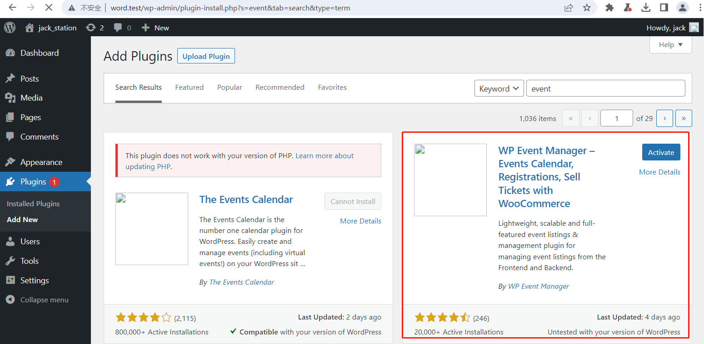
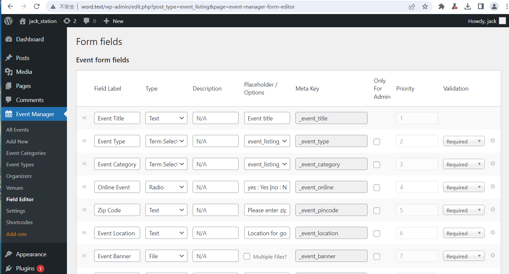
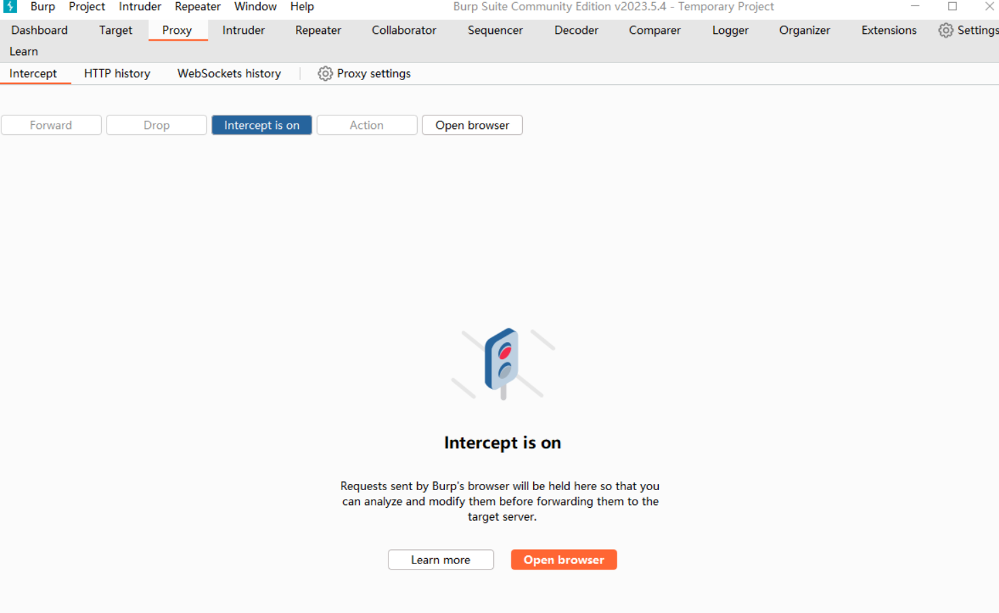
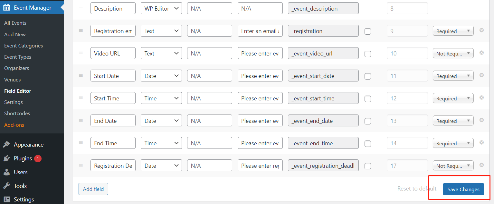
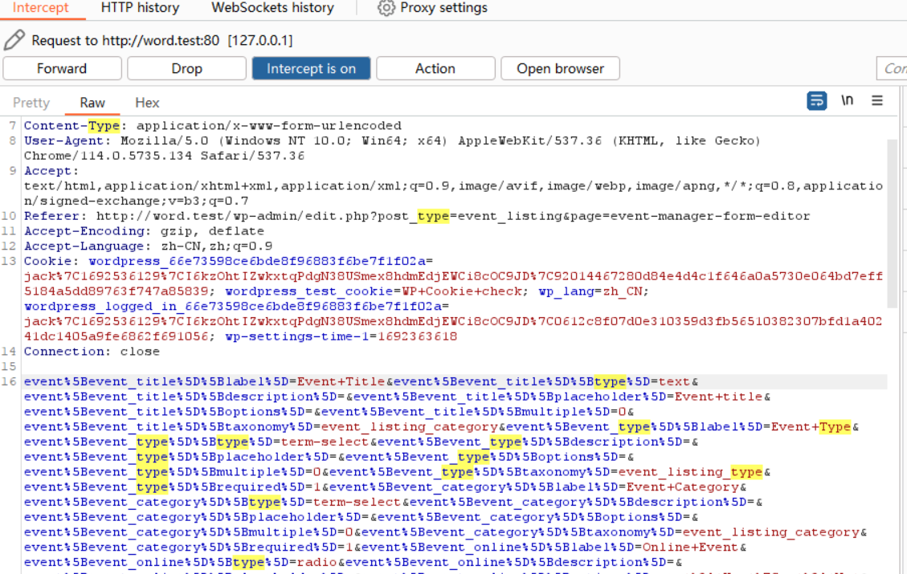
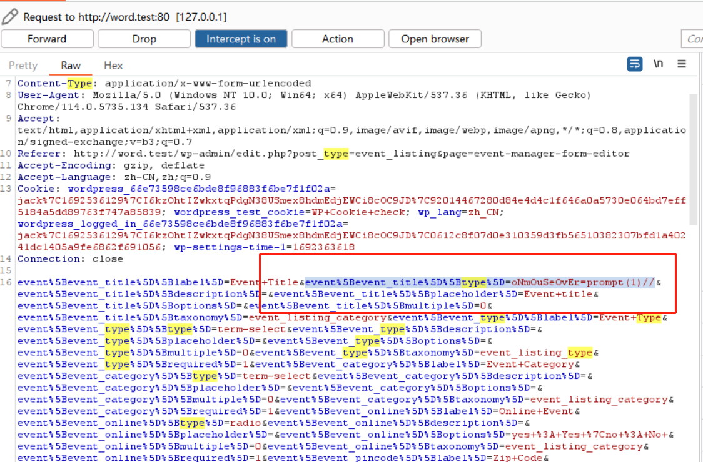
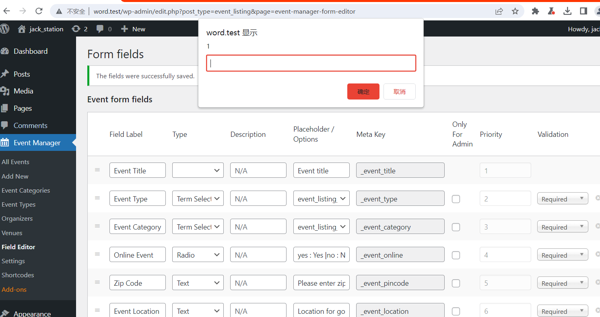
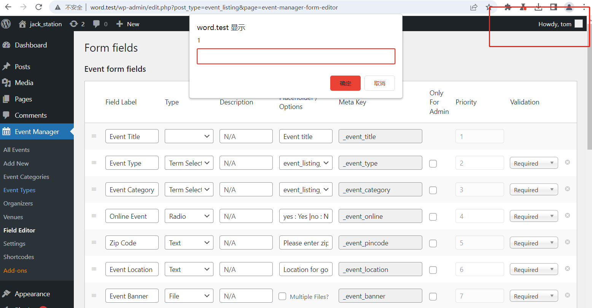
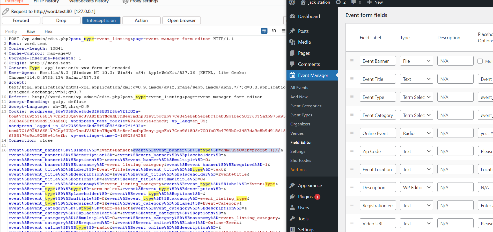
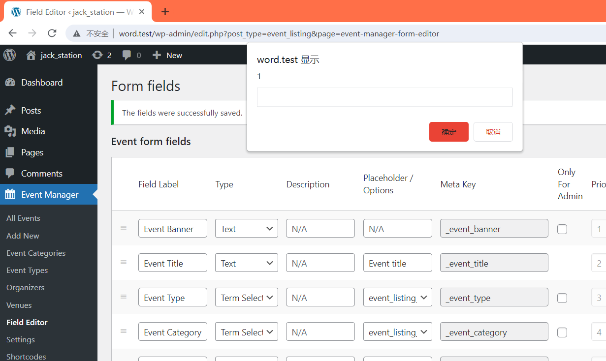

**1. Install the plugin "WP Event Manager – Events Calendar, Registrations, Sell Tickets with WooCommerce" from the plugin marketplace. After that, activate the plugin.**

**2. Navigate to the URL: http://word.test/wp-admin/edit.php?post_type=event_listing&page=event-manager-form-editor.**

**3. Launch Burp Suite to capture the network traffic.**

**4. Click on "save changes" below the form. Burp Suite will intercept the outgoing POST request.**

**5. Modify the value of the event[event_title][type] parameter to oNmOuSeOvEr=prompt(1)//, and then allow the request to proceed.**

**6. After moving the cursor over the table, a popup will appear on the web page. Logging out and logging back in still triggers the XSS.**

**7. Switch to the "tom" user account (which also has admin privileges), and moving the cursor over the table again will trigger the XSS. This behavior suggests that it might be a stored XSS.**

**8. However, it's not just the event[event_banner][type] parameter that can cause XSS. In fact, it is the event[xxx][type] parameter located in the first row of this form that causes XSS. By dragging the button on the left of each row and moving it to the first row, then modifying the POST request's event[xxx][type] to oNmOuSeOvEr=prompt(1)//, XSS can also be triggered. For instance, if you move the "Event Banner" row to the top and modify the POST request's event[event_banner][type] to oNmOuSeOvEr=prompt(1)//, a popup will appear when the cursor is moved over the form.**

