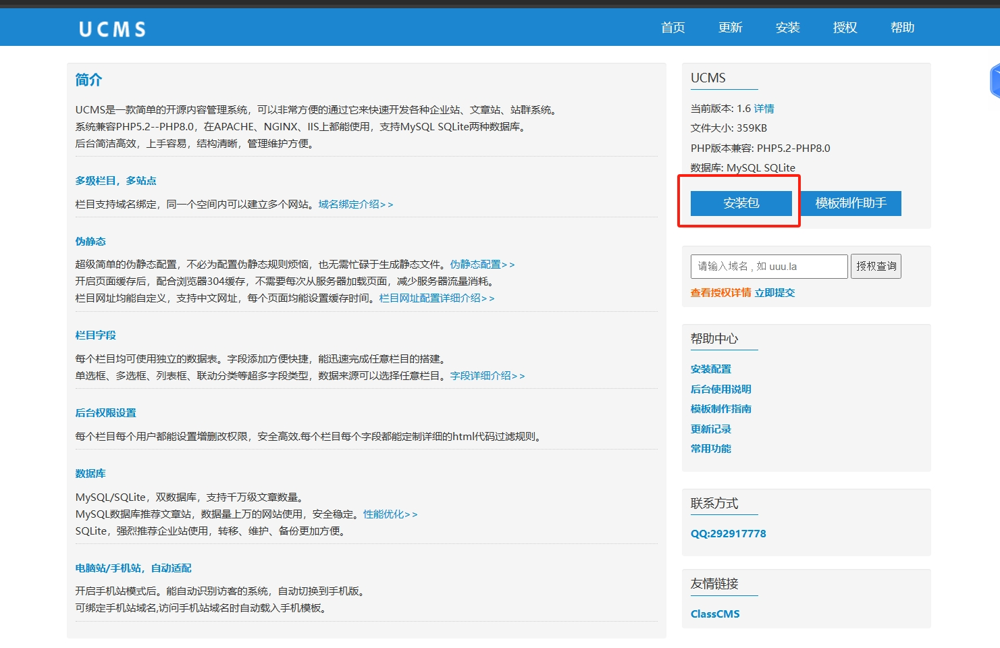
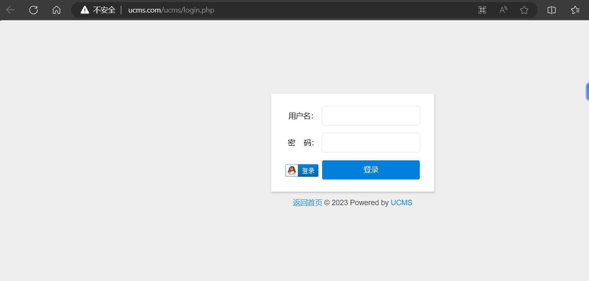
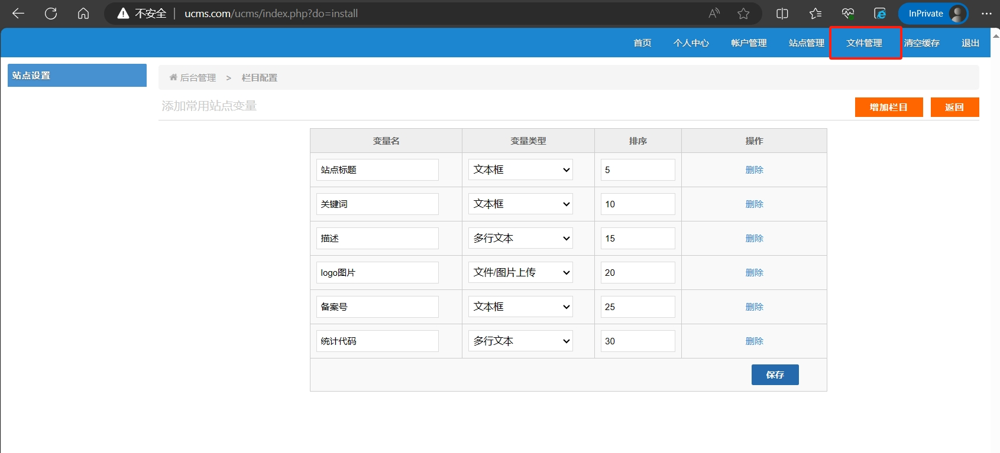
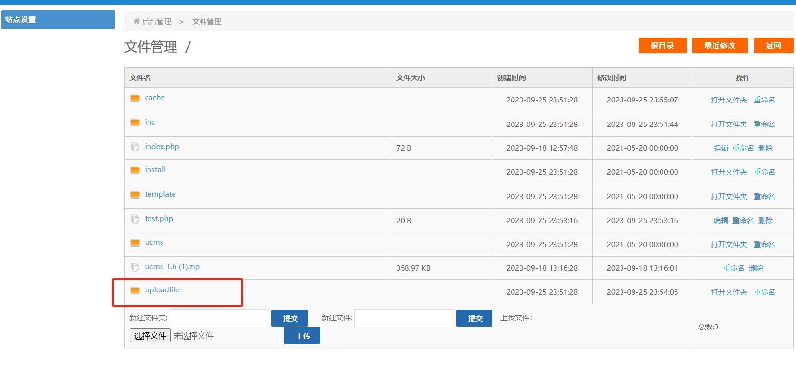
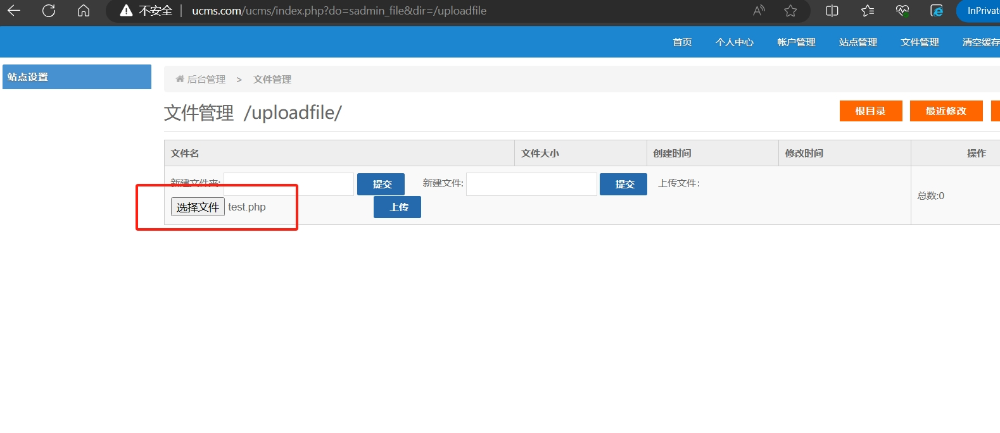
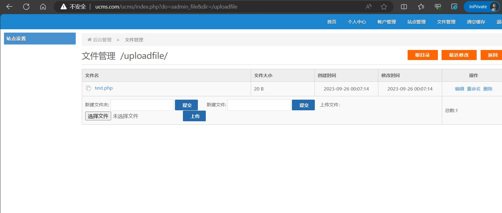
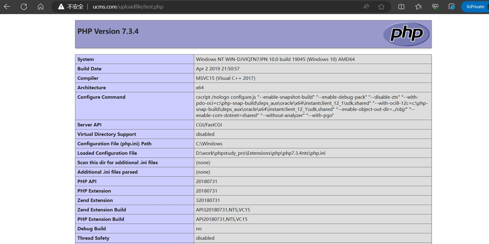

##  Vulnerability Reproduction:
## 1. The CMS with the vulnerability is named UCMS. Its official website is http://uuu.la/. You can download it by clicking the button highlighted in red.

## 2. After the CMS is installed, assuming the website's domain is http://ucms.com/, you can access the website's backend login page via http://ucms.com/ucms/login.php.

## 3. After entering the username and password set up previously, you'll be directed to the backend. Click on the file management button highlighted in red to access the file management page.

## 4. Click on the 'uploadfile' folder to enter it.

## 5. Click 'Choose File' and select 'test.php'. The content inside 'test.php' is `<?php phpinfo(); ?>`.

## 6. Click 'Upload'. At this point, 'test.php' has been uploaded to the 'uploadfile' folder located in the website's root directory.

## 7. By visiting http://ucms.com/uploadfile/test.php, you can see that the PHP file has been successfully uploaded, and the PHP code can be executed smoothly.

