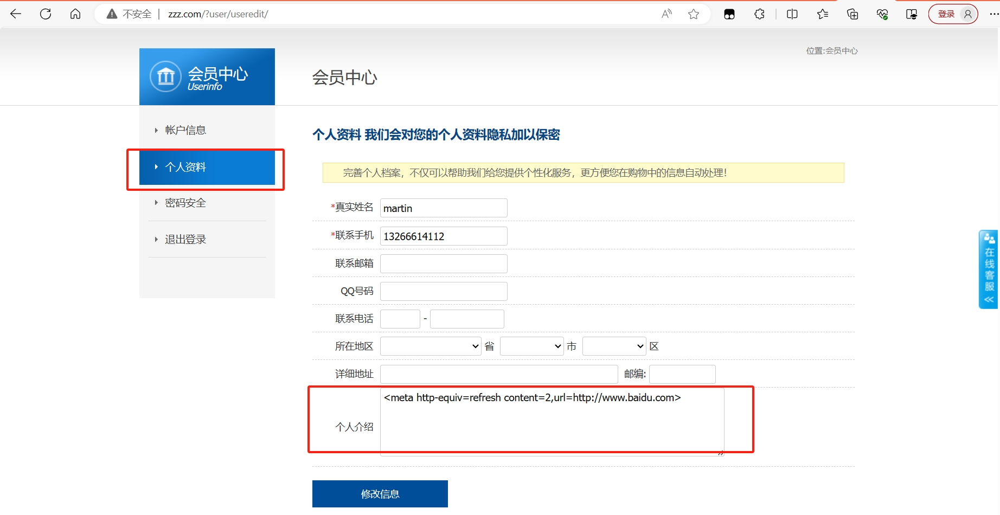

## zzzcms-V2.2.0 has an arbitrary URL redirection vulnerability.
The official website for this CMS is http://www.zzzcms.com/a/news/31_313.html

You can download the CMS from http://115.29.55.18/zzzphp.zip

## 1. Download and install zzzcms. After installation is complete, go to the homepage.

## 2. Click on the registration button in the top right corner and register a new user.

## 3. Navigate to the personal profile page in the user center. In the text box for personal introduction, enter the payload: <meta http-equiv=refresh content=2,url=http://www.baidu.com> and save.

## 4. Now go to the account information page in the user center. This page will automatically redirect to the website http://www.baidu.com.

## 5. When you view the source code, the payload has been inserted into the html page.

